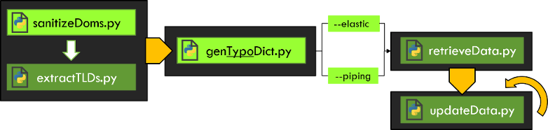

# Detección de dominios typosquatting
Sistema de monitorización de dominios typosquatting.
Está basado en recoger información con peticiones DNS (en la fase 1 también se utilizaban peticiones Whois y HTTP) y almacenarla en un servidor de búsqueda Elasticsearch.
El objetivo final de este proyecto es analizar la viabilidad técnica de la solución.

## Paso a paso

En primer lugar, se debe configurar el entorno ejecutando `setup.sh`.



A continuación, hay que convertir los ficheros .xlsx proporcionados por los clientes en .txt y guardarlos en el directorio `original-txt-files/`

### Paso 1A: Eliminar dominios inválidos y duplicados
```
mkdir DAT; cd DAT
python ../sanitizeDoms.py ../original-txt-files/
cd ..
```

### Paso 1B: Extraer TLDs
```
python extractTLDs.py >> tlds.json
# revisar la salida tlds.json
cat tlds.json
mv tlds.json tlds41.json
```

### Paso 2: Generar diccionario (8h50min)
```
# revisar el formato de nombre de los .dat: CUST_CODE_-_Domains.dat
ls DAT/
python genTypoDict.py tlds41.json DAT/ -E dict -V
```

### Paso 3: Obtener información
```
mkdir times; mkdir logs; mkdir logs/logs-retrDat
bash multiRetrDatCust.sh dict data
# recoge info cliente a cliente, paralelizando 13 técnicas typosquatting por cada uno
```

### Paso 4: Actualizar información (automatizar en crontab)
```
mkdir logs/logs-upDat
task="30 2,10,18 * * * date >> ~/log-multiUpDat.txt
30 2,10,18 * * * bash ~/multiUpDat.sh results >> ~/log-multiUpDat.txt"
(crontab -u $USER -l; echo "$task" ) | crontab -u $USER -
```
